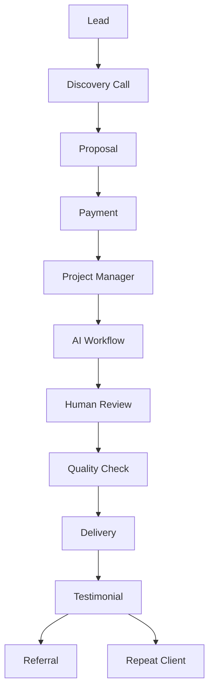

# From $100/Day to $10,000/Month: Building an AI Agency That Runs Without You

*Part 6 of the **Zero to $100/Day AI Business** series.*

> Your goal is no longer to become a better freelancer.
>
> Your goal is to become the owner of a business that earns money through systems, processes, automation, and a team.

---

# Table of Contents

- Why Freelancers Hit an Income Ceiling
- The AI Agency Model
- Choosing Your Niche
- Designing Productized Services
- Building SOPs
- Hiring Without Employees
- Managing Quality
- Automating the Business
- Financial Planning
- Marketing Without Ads
- Scaling to $10,000/Month
- Common Mistakes
- 12-Month Roadmap
- Final Thoughts

---

# The Freelancing Ceiling

Every freelancer eventually reaches the same problem.

```
More Clients
        │
        ▼
More Work
        │
        ▼
Less Free Time
```

Your income depends on your availability.

If you stop working...

Income stops.

Businesses work differently.

---

# Business Mindset

Instead of asking:

> "How do I complete this project?"

Start asking:

> "How can this project be completed without me doing every step?"

That single question changes everything.

---

# The AI Agency Model

```text
Lead
   │
   ▼
Sales
   │
   ▼
Project Manager
   │
   ▼
AI Workflow
   │
   ▼
Quality Review
   │
   ▼
Delivery
```

Notice something?

The owner doesn't perform every task.

The owner builds the system.

---

# Stage 1

## Become an Expert in One Service

Choose one specialization.

Examples

- Resume Services
- LinkedIn Optimization
- SEO Blogging
- Product Descriptions
- AI Research
- SOP Documentation

Master one before adding another.

---

# Stage 2

## Productize Your Service

Instead of charging hourly...

Sell packages.

Example

| Package | Price |
|---------|-------:|
| Starter | $49 |
| Professional | $99 |
| Premium | $199 |

Packages are easier to sell.

---

# Stage 3

## Build SOPs

Everything repeatable should become a document.

Example

```
Receive Client

↓

Collect Files

↓

Run Prompt

↓

Review Output

↓

Format

↓

Export

↓

Deliver

↓

Request Review
```

If someone else cannot follow your process...

Your SOP isn't finished.

---

# Stage 4

## Build a Prompt Library

Organize prompts by category.

```
Prompts/

Resume/

LinkedIn/

Marketing/

SEO/

Research/

Emails/

Editing/
```

After 100 projects...

Your prompts become valuable intellectual property.

---

# Stage 5

## Create Templates

Every document should already exist.

Examples

- Proposal
- Invoice
- Welcome Email
- Delivery Email
- FAQ
- Revision Policy
- Thank You Message

Never recreate the same document twice.

---

# Stage 6

## Build a Knowledge Base

Store everything.

```
Knowledge Base

Pricing

Policies

Prompt Library

Client Questions

Brand Voice

Examples

Checklists

SOPs
```

Future team members should learn from your documentation.

---

# When Should You Hire?

Don't hire because you're busy.

Hire because:

- Work is repetitive.
- Revenue is stable.
- Processes are documented.

---

# First Team Members

Instead of full-time employees...

Consider freelancers.

Possible roles:

- Editor
- Designer
- Research Assistant
- Virtual Assistant
- Proofreader

Pay per project initially.

---

# Quality Control

Every project should pass through a checklist.

```
Grammar

Spelling

Formatting

Client Instructions

Brand Voice

Final PDF

Editable Copy
```

Consistency builds reputation.

---

# Marketing Without Paid Ads

Continue using:

- LinkedIn
- Reddit
- Facebook Groups
- Referrals
- Testimonials
- Cold Outreach

Also consider:

- Blogging
- GitHub Pages portfolio
- Email newsletter
- Networking events
- Partnerships

---

# Build Authority

Publish useful content regularly.

Ideas:

- Resume tips
- AI tutorials
- Prompt libraries
- Case studies
- Before/after examples

People trust experts who teach.

---

# Build a Portfolio Website

Include:

- Home
- Services
- Pricing
- Portfolio
- Testimonials
- Contact

GitHub Pages is enough to start.

---

# Financial Planning

Track every dollar.

Simple spreadsheet.

| Month | Revenue | Expenses | Profit |
|--------|---------|---------|--------|
| January | $1,200 | $100 | $1,100 |
| February | $1,600 | $150 | $1,450 |

Review monthly.

---

# Revenue Goals

Example roadmap.

| Stage | Monthly Goal |
|--------|-------------:|
| Beginner | $500 |
| Consistent Freelancer | $2,000 |
| Full-Time Freelancer | $5,000 |
| Small AI Agency | $10,000 |
| Established Agency | $25,000+ |

Treat these as illustrative milestones rather than guarantees.

---

# Diversify Income

Don't rely on one service.

Possible income streams:

- Freelance services
- Monthly retainers
- Digital templates
- Prompt packs
- E-books
- Courses
- Consulting
- Workshops
- Affiliate income

Multiple streams improve business resilience.

---

# Build Assets

Assets continue creating value.

Examples

- Prompt libraries
- Templates
- SOPs
- Portfolio
- Blog articles
- Email list
- Brand reputation

Unlike hours worked, assets can compound over time.

---

# Common Mistakes

## Hiring Too Early

Master the work first.

---

## No Documentation

If knowledge stays in your head...

Growth becomes difficult.

---

## Ignoring Existing Clients

Repeat business is often easier than finding new customers.

---

## Constantly Changing Niches

Stay focused.

Consistency builds expertise.

---

# The 12-Month Roadmap

## Months 1–3

- Find first clients
- Improve prompts
- Create templates
- Build portfolio

---

## Months 4–6

- Raise prices
- Build SOPs
- Add recurring packages
- Collect testimonials

---

## Months 7–9

- Delegate repetitive work
- Improve automation
- Publish helpful content
- Build authority

---

## Months 10–12

- Expand services carefully
- Strengthen client relationships
- Refine financial tracking
- Build a scalable operating system

---

# Agency Workflow



---

# Monthly CEO Checklist

- [ ] Review revenue
- [ ] Review expenses
- [ ] Improve one SOP
- [ ] Improve one AI prompt
- [ ] Publish one useful article
- [ ] Collect testimonials
- [ ] Follow up with previous clients
- [ ] Update portfolio
- [ ] Review pricing
- [ ] Plan next month's goals

---

# Final Thoughts

The first goal was earning your first **$100/day**.

The next goal is building a business that does not depend entirely on your personal time.

AI is a powerful productivity tool, but sustainable businesses are built on:

- Clear systems
- Consistent quality
- Reliable client relationships
- Continuous learning
- Thoughtful automation

Start small, document everything, improve every week, and let your business evolve through steady refinement rather than shortcuts.

---

## Series Complete

You have now completed the full **Zero to $100/Day AI Business** series:

1. Launching an AI service business in 48 hours
2. Choosing profitable AI services
3. Building with free tools
4. Finding paying clients
5. Scaling to consistent $100+ days
6. Growing into a systems-driven AI agency

These six articles provide a practical foundation that you can adapt as AI tools, markets, and customer needs continue to evolve.
