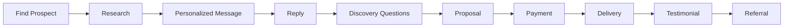

# Finding Paying Clients Without Followers or Ads

*Part 4 of the **Zero to $100/Day AI Business** series.*

> The biggest myth about freelancing is that you need thousands of followers before you can make money.
>
> You don't.
>
> Clients don't care how many followers you have. They care whether you can solve their problem.

This guide explains how to consistently find potential clients using free platforms and simple outreach strategies.

---

# Table of Contents

- Why Most People Never Get Their First Client
- The Client Acquisition Formula
- Where to Find Clients
- Writing Messages That Get Replies
- Daily Outreach System
- Discovery Questions
- Closing the Sale
- Handling Objections
- Following Up
- Building Long-Term Relationships
- Weekly Metrics
- 30-Day Client Acquisition Plan
- Key Takeaways

---

# Why Most People Never Get Their First Client

Most beginners spend weeks:

- Designing logos
- Creating websites
- Building social media pages
- Making business cards

Yet they never actually speak to potential customers.

Clients come from conversations.

The fastest path to your first sale is simply talking to people who already need help.

---

# The Client Acquisition Formula

```text
Prospects
      │
      ▼
Conversations
      │
      ▼
Discovery
      │
      ▼
Proposal
      │
      ▼
Payment
      │
      ▼
Delivery
      │
      ▼
Referral
```

Each step matters.

Skip one, and the process slows down.

---

# Where to Find Clients

## LinkedIn

Ideal for:

- Professionals
- Recruiters
- Small business owners
- Consultants

Search for posts like:

```
Need resume help

Looking for copywriter

Hiring freelancer

Need LinkedIn profile

Open to work
```

People posting publicly are already looking for solutions.

---

## Reddit

Popular communities include:

- r/resumes
- r/jobs
- r/freelance
- r/Entrepreneur
- r/smallbusiness
- r/startups

Search terms:

```
Need help

Looking for

Resume review

Business description

LinkedIn advice
```

Avoid spamming.

Join conversations and provide genuine value.

---

## Facebook Groups

Search for groups such as:

- Job seekers
- Local business owners
- Entrepreneurs
- Digital marketing
- Small business support

Read the group rules before posting.

---

## Local Businesses

Search Google Maps for:

- Restaurants
- Salons
- Cafes
- Gyms
- Retail shops

Many businesses have incomplete profiles, outdated descriptions, or unanswered customer reviews.

These are opportunities.

---

## Freelance Marketplaces

Examples include:

- Fiverr
- Upwork
- Freelancer

Competition is higher, but they can provide long-term opportunities once your profile grows.

---

# Build a Prospect List

Create a spreadsheet.

| Name | Platform | Service Needed | Contacted | Follow-up | Status |
|------|----------|----------------|-----------|-----------|--------|
| John | LinkedIn | Resume | Yes | Friday | Waiting |
| Emma | Reddit | LinkedIn | No | - | New |
| Rahul | Facebook | Product Listing | Yes | Tomorrow | Interested |

A simple tracker prevents missed opportunities.

---

# Daily Outreach Goal

Aim for consistency.

Example:

| Activity | Daily Target |
|----------|-------------:|
| New prospects | 30 |
| Personalized messages | 20 |
| Replies | 5 |
| Discovery calls or chats | 2 |
| Closed clients | 1–2 |

You don't need hundreds of clients.

You need a steady pipeline.

---

# Writing Messages That Get Replies

Keep your messages:

- Short
- Relevant
- Personalized
- Helpful

Avoid long introductions.

---

## Example 1: Resume Service

```
Hi Sarah,

I noticed you're looking for help improving your resume.

I specialize in ATS-friendly resume rewrites and LinkedIn optimization.

If you're interested, I'd be happy to review your current resume and explain how I would improve it.

No obligation.

Best,
[Your Name]
```

---

## Example 2: Local Business

```
Hello,

I came across your Google Business Profile and noticed a few areas that could help improve your online presence.

I help businesses optimize descriptions, service listings, and customer review responses.

If you're interested, I'd be happy to share a few suggestions.

Thanks.
```

---

## Example 3: Content Creator

```
Hi,

I've been following your content and noticed you're posting regularly.

I help creators save time by writing short-form video scripts and social media captions using AI-assisted workflows.

If you'd like to see a sample, I'd be happy to prepare one.

Thanks!
```

---

# Avoid These Mistakes

Don't write:

```
Hi

Need service?

Please hire me

I'm available
```

These messages rarely receive replies.

---

# Personalization Matters

Mention something specific.

For example:

```
I liked your recent LinkedIn article on project management.

I noticed your profile could be strengthened with a clearer headline and keyword optimization.
```

Specific observations build credibility.

---

# Discovery Questions

Before quoting a price, understand the client's needs.

Ask questions like:

- What are you trying to achieve?
- Who is your target audience?
- Do you have examples you like?
- What deadline are you working with?
- What format do you need?

The more you understand, the better your proposal.

---

# Presenting Your Offer

Keep it simple.

Example:

```
Based on your requirements, I recommend:

✔ Resume Rewrite
✔ ATS Optimization
✔ PDF + Editable Version
✔ One Revision

Delivery:
24 Hours

Price:
$25
```

Clear offers reduce confusion.

---

# Handling Common Objections

## "I Need to Think About It"

Reply:

```
Of course.

Take your time.

If you have any questions, I'm happy to answer them.
```

---

## "It's Too Expensive"

Don't immediately reduce your price.

Instead:

```
I understand.

The price includes personalized editing, formatting, and revisions.

If you'd prefer, I also offer a simpler package with fewer features.
```

Offer options rather than discounts.

---

## "Can You Do It for Free?"

Politely decline.

```
I'd love to help, but this is a professional service.

If you'd like, I can suggest a few free resources that may be useful.
```

Respect your own work.

---

# Following Up

Many clients don't reply immediately.

Follow up after two or three days.

Example:

```
Hi,

Just checking in to see if you're still interested.

Happy to answer any questions or provide more information.

Have a great day!
```

One or two polite follow-ups are enough.

Avoid repeated messages.

---

# Deliver Excellent Service

A happy client often becomes:

- A repeat customer
- A referral source
- A testimonial
- A long-term relationship

Small details matter:

- Meet deadlines.
- Communicate clearly.
- Deliver clean, organized files.
- Respond professionally.

---

# Ask for Testimonials

After successful delivery:

```
Thank you for working with me.

If you're happy with the result, I'd really appreciate a short testimonial.

It helps future clients understand the quality of my work.
```

Positive reviews build trust.

---

# Request Referrals

Satisfied clients often know others with similar needs.

Example:

```
If you know anyone who might benefit from similar services, I'd appreciate a referral.

Thank you again!
```

Referrals are one of the most reliable sources of new business.

---

# Weekly Outreach Metrics

Track your progress.

| Metric | Goal |
|---------|-----:|
| New prospects | 150 |
| Personalized messages | 100 |
| Replies | 20 |
| Discovery conversations | 10 |
| Paid projects | 5 |

These numbers are examples.

Adjust them as you learn what works.

---

# 30-Day Client Acquisition Plan

## Week 1

- Create service packages.
- Build sample work.
- Start daily outreach.

---

## Week 2

- Refine your messages.
- Improve response rates.
- Collect testimonials.

---

## Week 3

- Raise prices slightly.
- Add upsell services.
- Request referrals.

---

## Week 4

- Focus on repeat clients.
- Create standard workflows.
- Build a portfolio website if needed.

---

# Outreach Workflow



---

# Daily Success Checklist

- [ ] Found 30 new prospects
- [ ] Sent 20 personalized messages
- [ ] Followed up with previous contacts
- [ ] Completed client work
- [ ] Requested testimonials
- [ ] Recorded progress in spreadsheet

Small daily actions compound over time.

---

# Key Takeaways

- You don't need followers to find clients.
- Focus on solving real problems.
- Personalize every message.
- Ask questions before quoting a price.
- Deliver quality work and request testimonials.
- Consistent outreach creates a predictable pipeline of opportunities.

---

# Next Article

In **Part 5**, you'll learn how to transform your first few projects into a repeatable AI-powered business that consistently earns **$100 or more per day**.

Topics include:

- Delivering projects efficiently
- Upselling and increasing order value
- Raising your prices confidently
- Creating repeatable systems
- Building recurring monthly income
- Scaling beyond freelancing

---

## Series Navigation

- ✅ Part 1: *How to Build a $100/Day AI Income Machine in 48 Hours Using Only Your Phone*
- ✅ Part 2: *Choosing an AI Service That Can Earn $100 Per Day*
- ✅ Part 3: *Building Your AI Service Business with Free Tools*
- ✅ Part 4: *Finding Paying Clients Without Followers or Ads*
- ➜ Part 5: *Scaling Your AI Service Business to Consistent $100+ Days*
