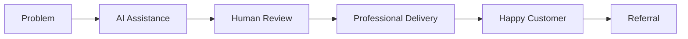
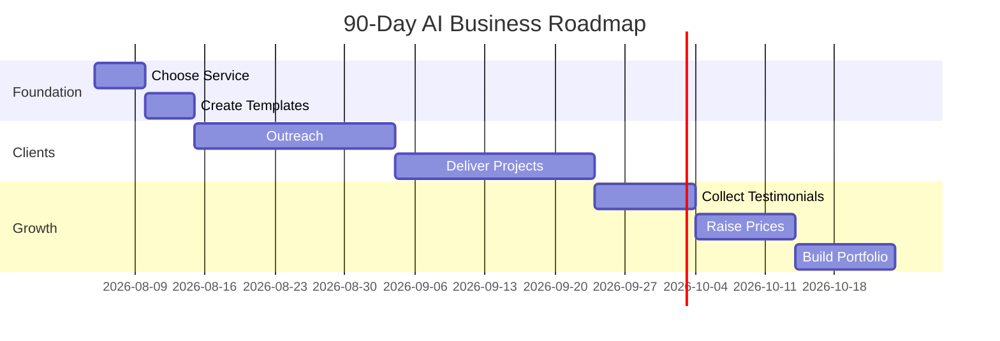

# The AI Solopreneur Playbook: 100 AI Business Ideas You Can Start With Zero Dollars

*Part 7 of the **Zero to $100/Day AI Business** series.*

> Every successful business starts with one simple idea:
>
> **Solve a problem that someone is willing to pay for.**
>
> AI doesn't create demand—it helps you solve problems faster, better, and more efficiently.

This guide presents **100 practical AI-powered business ideas** that can be started with little or no upfront investment. Many require only a smartphone, an internet connection, and free AI tools.

---

# Table of Contents

- Choosing the Right Business Idea
- The AI Opportunity Framework
- 100 AI Business Ideas
- Selecting Your First Business
- Validation Before You Build
- Income Potential
- Avoiding Common Mistakes
- 90-Day Launch Plan
- Resources
- Final Thoughts

---

# Choosing the Right Business Idea

Before picking an idea, ask yourself four questions:

- Does this solve a real problem?
- Can AI reduce the time needed to deliver it?
- Are people already paying for something similar?
- Can I complete the work repeatedly?

If the answer is "yes" to all four, the idea deserves further exploration.

---

# The AI Opportunity Framework

---

# Category 1 — Writing Services

1. Resume Writing
2. Cover Letters
3. LinkedIn Profiles
4. Blog Writing
5. Website Copywriting
6. Product Descriptions
7. Sales Pages
8. Email Campaigns
9. Newsletters
10. Press Releases

---

# Category 2 — Content Creation

11. Instagram Captions
12. Facebook Posts
13. LinkedIn Posts
14. Twitter/X Threads
15. YouTube Scripts
16. Podcast Show Notes
17. Video Titles
18. Video Descriptions
19. Content Calendars
20. SEO Articles

---

# Category 3 — Marketing

21. Google Business Optimization
22. Local SEO Content
23. Keyword Research
24. Landing Pages
25. Ad Copy
26. Marketing Funnels
27. Lead Magnets
28. Customer Personas
29. Marketing Audits
30. Competitor Analysis

---

# Category 4 — Business Documentation

31. SOP Writing
32. Employee Handbooks
33. Training Manuals
34. Business Proposals
35. Meeting Minutes
36. Policy Documents
37. Workflow Documentation
38. Checklists
39. Business Plans
40. Executive Summaries

---

# Category 5 — Design Assistance

41. Canva Presentations
42. Social Media Graphics
43. Infographics
44. Posters
45. Flyers
46. Business Cards
47. Event Invitations
48. Ebook Covers
49. Certificates
50. Digital Planners

---

# Category 6 — Research

51. Industry Reports
52. Market Research
53. Competitor Reports
54. Product Comparisons
55. Literature Reviews
56. Survey Summaries
57. Trend Reports
58. Company Profiles
59. Buyer Research
60. Educational Notes

---

# Category 7 — Productivity

61. Email Organization
62. Document Formatting
63. PDF Conversion
64. Spreadsheet Cleanup
65. Data Entry
66. Calendar Planning
67. Task Management
68. Workflow Optimization
69. Knowledge Base Creation
70. AI Prompt Libraries

---

# Category 8 — Education

71. Study Guides
72. Flashcards
73. Lesson Plans
74. Quiz Creation
75. Practice Tests
76. Language Learning Material
77. Notes Summarization
78. Presentation Slides
79. Research Assistance
80. Exam Preparation

---

# Category 9 — AI Consulting

81. ChatGPT Training
82. AI Workflow Setup
83. Prompt Engineering
84. AI Tool Selection
85. Business AI Audits
86. AI Productivity Coaching
87. Team AI Training
88. AI Documentation
89. AI Policy Drafting
90. AI Integration Planning

---

# Category 10 — Digital Products

91. Prompt Packs
92. Resume Templates
93. Canva Templates
94. Notion Templates
95. Spreadsheet Templates
96. AI Checklists
97. Business Toolkits
98. Digital Workbooks
99. Online Guides
100. AI Resource Libraries

---

# Which Idea Should You Choose?

Use this decision matrix.

| Question | Yes | No |
|----------|:---:|:--:|
| Can I explain the service in one sentence? | ✅ | ❌ |
| Can I deliver it within 24–48 hours? | ✅ | ❌ |
| Is there existing demand? | ✅ | ❌ |
| Can AI speed up the work? | ✅ | ❌ |
| Can I improve quality through review? | ✅ | ❌ |

Choose ideas that score well across all questions.

---

# Validate Before You Build

Avoid spending weeks creating a website or branding before confirming demand.

Simple validation steps:

1. Create a clear one-paragraph service description.
2. Share it with potential customers.
3. Ask for feedback.
4. Accept your first project.
5. Refine your process based on real experience.

Validation is more valuable than assumptions.

---

# Example Business Bundle

Instead of selling individual services, combine related offerings.

### Career Success Package

Includes:

- Resume Rewrite
- Cover Letter
- LinkedIn Optimization
- Interview Preparation Guide

One package is often easier to market than four separate services.

---

# Example Monthly Business Plan

## Week 1

- Choose one service.
- Create templates.
- Build a simple portfolio.

## Week 2

- Reach out to prospective clients.
- Deliver initial projects.
- Collect testimonials.

## Week 3

- Improve pricing.
- Build reusable systems.
- Add complementary services.

## Week 4

- Introduce recurring packages.
- Document workflows.
- Plan next month's goals.

---

# Income Possibilities

The figures below are illustrative examples and will vary depending on experience, market demand, pricing, and client acquisition.

| Service Price | Projects per Day | Example Daily Revenue |
|--------------:|-----------------:|----------------------:|
| $20 | 5 | $100 |
| $35 | 3 | $105 |
| $50 | 2 | $100 |
| $75 | 2 | $150 |
| $100 | 1 | $100 |

Focus on providing value rather than chasing arbitrary numbers.

---

# Common Mistakes

## Trying Everything

Specialize before expanding.

---

## Ignoring Quality

AI accelerates work but still requires careful review.

---

## Undervaluing Your Time

Review your pricing regularly as your skills and reputation grow.

---

## Failing to Build Systems

Document successful workflows so they can be repeated consistently.

---

# 90-Day Launch Roadmap

---

# Useful Free Resources

- ChatGPT
- Google Docs
- Google Sheets
- Google Drive
- Canva
- Notion
- GitHub Pages
- Grammarly (Free)
- Microsoft Designer (Free features)

Choose tools based on your workflow and needs rather than using every available platform.

---

# Final Checklist

Before launching your AI business:

- [ ] One clearly defined service
- [ ] One target audience
- [ ] Reusable templates
- [ ] Prompt library
- [ ] Sample portfolio
- [ ] Pricing structure
- [ ] Outreach plan
- [ ] Delivery workflow
- [ ] Feedback process
- [ ] Continuous improvement plan

---

# Final Thoughts

There has never been a better time to start a small service business powered by AI.

Success doesn't come from using the newest AI model or the most expensive software.

It comes from consistently solving real problems, communicating clearly, delivering quality work, and improving your systems over time.

Start with one service. Help one client. Learn from the experience. Repeat the process.

Small improvements, applied consistently, can compound into a sustainable business.

---

## What's Next?

Future topics in this series may include:

- Building AI-powered micro-SaaS products
- Selling digital products with AI
- Creating an AI content agency
- Building a personal brand
- Using automation tools responsibly
- Managing remote teams
- Advanced prompt engineering
- AI business ethics and best practices

---

## Series Navigation

- ✅ Part 1 — Launch Your AI Service Business
- ✅ Part 2 — Choosing Profitable AI Services
- ✅ Part 3 — Building with Free Tools
- ✅ Part 4 — Finding Paying Clients
- ✅ Part 5 — Scaling to $100+ Days
- ✅ Part 6 — Building an AI Agency
- ✅ Part 7 — 100 AI Business Ideas for Solopreneurs

*End of Part 7.*
