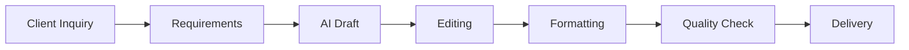

# Choosing an AI Service That Can Earn $100 Per Day

*Part 2 of the **Zero to $100/Day AI Business** series.*

> Before you search for clients, you need to answer one question:
>
> **What exactly are you going to sell?**
>
> This article helps you choose an AI-powered service that is easy to start, requires no investment, and has real market demand.

---

# Table of Contents

- [Why Most Beginners Fail](#why-most-beginners-fail)
- [The Three Rules of a Profitable AI Service](#the-three-rules-of-a-profitable-ai-service)
- [What Makes a Good Beginner Service?](#what-makes-a-good-beginner-service)
- [15 AI Services You Can Sell Today](#15-ai-services-you-can-sell-today)
- [Service Comparison Table](#service-comparison-table)
- [Pricing Guide](#pricing-guide)
- [Choosing Your Niche](#choosing-your-niche)
- [Creating a Simple Offer](#creating-a-simple-offer)
- [Packaging Your Service](#packaging-your-service)
- [Common Mistakes](#common-mistakes)
- [30-Day Growth Roadmap](#30-day-growth-roadmap)
- [Key Takeaways](#key-takeaways)

---

# Why Most Beginners Fail

Many newcomers make one of these mistakes:

- Offering everything.
- Copying popular influencers.
- Starting with a complicated business model.
- Spending weeks building a website.
- Waiting until everything feels "perfect."

The reality is much simpler.

People buy solutions to problems—not fancy websites or impressive logos.

Your goal is to identify one problem that AI can help solve quickly.

---

# The Three Rules of a Profitable AI Service

A good AI service meets three conditions.

## Rule 1: There Must Be Demand

Ask yourself:

- Are people already paying for this?
- Are businesses hiring freelancers for it?
- Can I find people asking for help today?

If the answer is yes, the market already exists.

---

## Rule 2: AI Should Save Time

AI should reduce your workload.

Example:

Without AI:

```
4 hours
```

With AI:

```
45 minutes
```

That difference is where your profit comes from.

---

## Rule 3: The Result Must Be Valuable

People pay for outcomes.

Examples include:

- More job interviews
- Better product listings
- Higher sales
- Professional documents
- Time savings

---

# What Makes a Good Beginner Service?

Look for services that are:

- Easy to learn
- Fast to deliver
- Repeatable
- In demand
- Suitable for remote work
- Low risk

---

# 15 AI Services You Can Sell Today

## 1. Resume Writing

**Customers**

- Students
- Professionals
- Career changers

Deliverables:

- ATS-friendly resume
- Cover letter
- LinkedIn summary

Price:

```
$20–60
```

---

## 2. LinkedIn Profile Optimization

Improve:

- Headline
- About section
- Experience
- Skills
- Keywords

Price:

```
$15–50
```

---

## 3. Product Descriptions

Ideal for:

- Shopify
- Amazon
- Etsy
- WooCommerce

Price:

```
$5–10 per product
```

---

## 4. Blog Writing

Businesses constantly need content.

Deliver:

- SEO titles
- Meta descriptions
- Images
- Internal links

Price:

```
$30–100
```

---

## 5. Email Writing

Examples:

- Sales emails
- Welcome sequences
- Cold outreach
- Customer support

Price:

```
$20–75
```

---

## 6. Social Media Content

Create:

- Instagram captions
- Facebook posts
- LinkedIn articles
- Twitter/X threads

Price:

```
$40–200 per month
```

---

## 7. Short Video Scripts

For:

- YouTube Shorts
- Instagram Reels
- TikTok

Price:

```
$5–15 each
```

---

## 8. Google Business Profile Optimization

Deliver:

- Business descriptions
- Review replies
- FAQ section
- Service descriptions

Price:

```
$30–100
```

---

## 9. AI Research Assistant

Research:

- Competitors
- Markets
- Products
- Industries

Deliver:

- PDF reports
- Summaries
- Tables

Price:

```
$50–150
```

---

## 10. Business SOP Creation

Businesses need:

- Standard Operating Procedures
- Employee manuals
- Process documentation

Price:

```
$100+
```

---

## 11. Website Copywriting

Deliver:

- Home page
- About page
- Services page
- FAQ

Price:

```
$100–500
```

---

## 12. AI Presentation Design

Create presentations using:

- Canva
- Google Slides

Price:

```
$30–150
```

---

## 13. Meeting Notes

Convert recordings into:

- Action items
- Summaries
- Minutes

Price:

```
$20–80
```

---

## 14. PDF to Editable Documents

Convert:

- PDFs
- Images
- Scanned documents

Price:

```
$10–50
```

---

## 15. Prompt Engineering

Businesses increasingly need:

- Prompt libraries
- AI workflows
- Internal documentation

Price:

```
$50–500
```

---

# Service Comparison Table

| Service | Difficulty | AI Friendly | Typical Price |
|----------|-----------|-------------|--------------:|
| Resume Writing | ⭐ | ⭐⭐⭐⭐⭐ | $20–60 |
| LinkedIn Optimization | ⭐ | ⭐⭐⭐⭐⭐ | $15–50 |
| Product Descriptions | ⭐ | ⭐⭐⭐⭐⭐ | $5–10/item |
| Blog Writing | ⭐⭐ | ⭐⭐⭐⭐ | $30–100 |
| Email Writing | ⭐ | ⭐⭐⭐⭐⭐ | $20–75 |
| Social Media | ⭐ | ⭐⭐⭐⭐⭐ | $40–200/month |
| Research Reports | ⭐⭐⭐ | ⭐⭐⭐⭐ | $50–150 |
| SOP Creation | ⭐⭐⭐ | ⭐⭐⭐⭐ | $100+ |

---

# Choosing Your Niche

Don't market to everyone.

Choose one audience.

Examples:

## Job Seekers

Needs:

- Resume
- LinkedIn
- Cover letter

---

## Restaurants

Needs:

- Menu descriptions
- Social media
- Google reviews

---

## Real Estate Agents

Needs:

- Property descriptions
- Ads
- Email campaigns

---

## Coaches

Needs:

- Instagram posts
- Blogs
- Newsletters

---

## Local Shops

Needs:

- Product descriptions
- Promotions
- Business profiles

---

# Create a Service Package

Instead of selling one item, bundle services.

Example:

## Starter Package

- Resume rewrite
- PDF formatting

Price:

```
$25
```

---

## Professional Package

- Resume
- Cover letter
- LinkedIn profile

Price:

```
$50
```

---

## Premium Package

Everything above plus:

- Interview preparation
- Job search tips
- Personalized revisions

Price:

```
$75
```

---

# Creating a Simple Offer

Your offer should answer four questions.

### What do you do?

> I rewrite resumes using AI and recruiter best practices.

---

### Who is it for?

> Professionals looking for interviews.

---

### What do they receive?

- Resume
- PDF
- Editable file
- LinkedIn summary

---

### How much?

```
$25
```

Simple wins.

---

# Example Offer

```text
Resume Rewrite

✔ ATS Friendly
✔ Modern Design
✔ Keyword Optimization
✔ 24-Hour Delivery

Introductory Price:
$25
```

---

# Packaging Your Service

People prefer clear packages.

Instead of saying:

"I do AI writing."

Say:

"I will rewrite your resume within 24 hours and optimize it for ATS systems."

Specific offers sell better.

---

# Workflow Diagram



---

# Common Mistakes

## Selling Too Cheap

Cheap prices attract difficult clients.

Instead:

- Start fair.
- Increase prices after testimonials.

---

## Too Many Niches

Don't offer:

- Resume writing
- Logos
- Websites
- Translation
- Accounting

Choose one.

---

## Ignoring Quality

AI makes mistakes.

Always:

- Proofread
- Verify facts
- Improve formatting

---

## No Process

Create a repeatable workflow.

Consistency builds trust.

---

# 30-Day Growth Roadmap

## Week 1

- Choose one service.
- Create templates.
- Complete practice projects.

---

## Week 2

- Contact 20–30 prospects daily.
- Deliver quickly.
- Request testimonials.

---

## Week 3

- Increase prices.
- Add upsells.
- Improve templates.

---

## Week 4

- Build a portfolio.
- Create reusable systems.
- Explore freelance marketplaces.

---

# Checklist

Before finding clients:

- [ ] Chosen one niche
- [ ] Defined one service
- [ ] Set pricing
- [ ] Created templates
- [ ] Prepared AI prompts
- [ ] Ready to deliver quickly

---

# Key Takeaways

- Sell solutions, not AI.
- Start with one service.
- Focus on one audience.
- Package your offer clearly.
- Use AI to increase speed—not replace quality.
- Build repeatable systems from day one.

---

# Next Article

In **Part 3**, you'll learn how to build a professional AI service business using only free tools.

Topics include:

- Setting up your workspace
- Writing effective AI prompts
- Creating reusable templates
- Formatting deliverables
- Managing files and clients
- Delivering polished work with free software

---

**Series Navigation**

- ✅ Part 1: *How to Build a $100/Day AI Income Machine in 48 Hours Using Only Your Phone*
- ✅ Part 2: *Choosing an AI Service That Can Earn $100 Per Day*
- ➜ Part 3: *Building Your AI Service Business with Free Tools*
