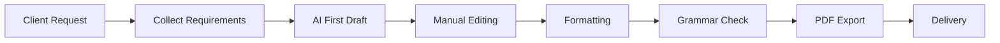

# Building Your AI Service Business with Free Tools

*Part 3 of the **Zero to $100/Day AI Business** series.*

> You don't need an expensive laptop, premium AI subscriptions, or paid software to start an AI service business.
>
> A smartphone, internet connection, and a handful of free tools are enough to deliver professional-quality work.

---

# Table of Contents

- [Your Digital Workspace](#your-digital-workspace)
- [Essential Free Tools](#essential-free-tools)
- [Organizing Your Business](#organizing-your-business)
- [Creating Reusable Templates](#creating-reusable-templates)
- [Writing Better AI Prompts](#writing-better-ai-prompts)
- [Building a Delivery Workflow](#building-a-delivery-workflow)
- [Quality Control Checklist](#quality-control-checklist)
- [Managing Clients](#managing-clients)
- [File Organization](#file-organization)
- [Automation Ideas](#automation-ideas)
- [Daily Operating Routine](#daily-operating-routine)
- [Next Steps](#next-steps)

---

# Your Digital Workspace

Think of your AI business like a small digital office.

```text
           CLIENT
              │
              ▼
      Receive Request
              │
              ▼
        AI Creates Draft
              │
              ▼
      Human Review & Edit
              │
              ▼
     Format Final Document
              │
              ▼
      Deliver to Client
              │
              ▼
         Receive Payment
```

Every project should follow the same process.

---

# Essential Free Tools

## ChatGPT

Purpose:

- Draft content
- Rewrite text
- Brainstorm ideas
- Generate outlines
- Improve grammar

Examples:

- Resume writing
- Product descriptions
- Emails
- Cover letters
- Blog articles

---

## Google Docs

Use for:

- Editing
- Collaboration
- Client feedback
- Exporting to PDF
- Cloud storage

Advantages:

- Free
- Works on mobile
- Auto saves

---

## Canva Free

Perfect for:

- Resume formatting
- Presentations
- Social media graphics
- PDFs
- Certificates
- Flyers

---

## Google Drive

Organize:

- Client files
- Templates
- Deliverables
- Receipts
- Contracts

---

## Gmail

Professional communication.

Create a dedicated business email if possible.

Example:

```
yourname.ai@gmail.com
```

---

## Google Sheets

Track:

- Clients
- Payments
- Leads
- Expenses
- Testimonials

---

# Organizing Your Business

Create a simple folder structure.

```text
AI Business

├── Templates
├── Prompts
├── Clients
├── Portfolio
├── Testimonials
├── Invoices
└── Resources
```

Inside **Clients**

```text
Clients

├── John Smith
│     Resume.docx
│     Resume.pdf
│     Notes.txt
│
├── Sarah
│     LinkedIn.docx
│
└── Rahul
      ProductDescriptions.docx
```

Organization saves time.

---

# Creating Reusable Templates

Never start from scratch.

---

## Resume Template

Include:

- Contact Information
- Professional Summary
- Experience
- Skills
- Education
- Certifications

---

## Email Template

```
Hello,

Thank you for your order.

I've received your requirements and will begin working immediately.

Expected delivery:
24 hours.

Thank you.
```

---

## Delivery Template

```
Hello,

Your project is complete.

Files included:

✔ Editable version
✔ PDF version

If you'd like revisions, feel free to let me know.

Thank you.
```

---

## Feedback Request

```
Thank you for choosing my service.

If you're happy with the work, I'd really appreciate a short testimonial.

Your feedback helps me improve and build trust with future clients.
```

---

# Writing Better AI Prompts

The quality of your prompts determines the quality of your output.

Instead of:

> Write a resume.

Try:

```text
Act as an experienced recruiter.

Rewrite the following resume.

Requirements:

- ATS friendly
- Professional tone
- Achievement-focused
- Strong action verbs
- One page
- Modern formatting
- Tailored for a Marketing Manager position

Resume:

[Paste Resume]
```

Specific instructions produce better results.

---

# Prompt Library

Create a folder called:

```
Prompts
```

Example:

```text
Resume Prompt.md

Blog Prompt.md

LinkedIn Prompt.md

Cover Letter Prompt.md

Email Prompt.md
```

Over time, this becomes one of your most valuable assets.

---

# Building a Delivery Workflow

Use the same workflow for every project.



Consistency improves speed.

---

# Collecting Requirements

Before starting, ask:

- What is the goal?
- Who is the audience?
- Any examples?
- Preferred tone?
- Deadline?
- File format?

Avoid guessing.

---

# Quality Control Checklist

Before delivering:

- [ ] Grammar checked
- [ ] Spelling checked
- [ ] Consistent formatting
- [ ] Proper headings
- [ ] Correct client name
- [ ] PDF exported
- [ ] Editable copy included

Never skip this step.

---

# Managing Clients

Keep a simple spreadsheet.

| Client | Service | Price | Status | Paid |
|---------|---------|------:|--------|------|
| John | Resume | $25 | Delivered | Yes |
| Sarah | LinkedIn | $30 | Pending | No |
| Rahul | Blog | $40 | Completed | Yes |

This prevents confusion.

---

# File Naming Convention

Bad:

```
resumefinalnewlatest.pdf
```

Good:

```
John_Smith_Resume_v1.pdf
John_Smith_Resume_Final.pdf
```

Simple naming avoids mistakes.

---

# Creating a Portfolio

You don't need paying clients to start.

Create sample projects.

Examples:

- Resume makeover
- Product description
- LinkedIn profile
- Blog article
- Email sequence

Save them in a **Portfolio** folder.

Potential clients often ask for examples.

---

# Building a Prompt Library

Over time, categorize prompts.

```text
Prompts

├── Resume
├── Cover Letter
├── LinkedIn
├── Blog
├── Email
├── Sales
├── Research
└── Editing
```

Good prompts reduce your workload.

---

# Automation Ideas

As your business grows:

- Duplicate templates instead of creating new files.
- Save frequently used responses.
- Use Google Drive folders for each client.
- Create reusable Canva designs.
- Build checklists for recurring tasks.

Automation saves time without costing money.

---

# Daily Operating Routine

A productive day might look like this:

## Morning

- Check messages
- Respond to inquiries
- Plan deliveries

---

## Afternoon

- Complete AI drafts
- Edit and format documents
- Export final files

---

## Evening

- Deliver completed work
- Request testimonials
- Send outreach messages to new prospects

Consistency is more important than working long hours.

---

# Security and Backups

Protect your work.

- Enable two-factor authentication.
- Back up important files to Google Drive.
- Keep copies of delivered work.
- Never delete client files immediately.

---

# Growing Your Toolkit

Once you begin earning, consider upgrading to:

- ChatGPT Plus (optional)
- Canva Pro (optional)
- Custom domain
- Professional email
- Simple portfolio website

Upgrade only when your income justifies the expense.

---

# Common Mistakes

## Relying Completely on AI

AI generates drafts.

You are responsible for:

- Accuracy
- Formatting
- Professional presentation

---

## Poor File Management

Disorganized folders waste time.

Create a system and follow it consistently.

---

## Ignoring Client Instructions

Always read the client's requirements before generating AI content.

---

## Delivering Without Proofreading

Small mistakes reduce trust.

Always review your work before sending it.

---

# Business Checklist

Before accepting your first client:

- [ ] Free tools installed
- [ ] Templates created
- [ ] Prompt library started
- [ ] Folder structure organized
- [ ] Portfolio samples prepared
- [ ] Quality checklist ready
- [ ] Spreadsheet for tracking clients created

---

# Key Takeaways

- Free tools are enough to launch an AI service business.
- Templates save hours of repetitive work.
- Well-written prompts improve AI output.
- A repeatable workflow increases efficiency.
- Organization and quality build a professional reputation.

---

# Next Article

In **Part 4**, you'll learn how to find paying clients without followers, paid ads, or a large online presence.

Topics include:

- Finding clients on Reddit, LinkedIn, and Facebook
- Cold outreach strategies
- Writing effective direct messages
- Handling objections
- Closing your first sale
- Building long-term client relationships

---

## Series Navigation

- ✅ Part 1: *How to Build a $100/Day AI Income Machine in 48 Hours Using Only Your Phone*
- ✅ Part 2: *Choosing an AI Service That Can Earn $100 Per Day*
- ✅ Part 3: *Building Your AI Service Business with Free Tools*
- ➜ Part 4: *Finding Paying Clients Without Followers or Ads*
