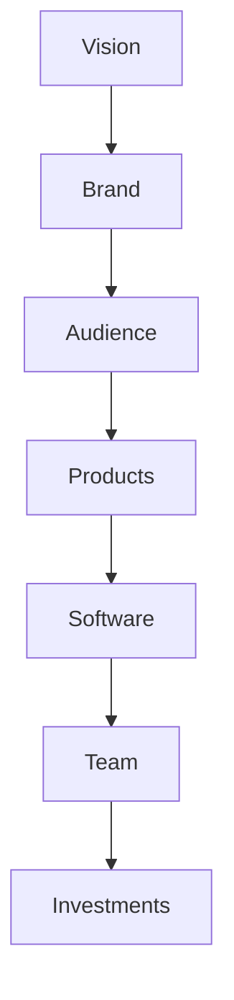
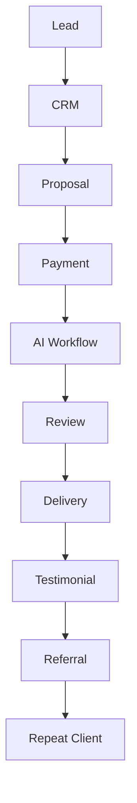

# The Ultimate AI Solopreneur Blueprint
## Part 9 — From Zero to a $1 Million AI Business

> *This is Part 9 of the **Zero to $100/Day AI Business** series.*

---

# Table of Contents

- Introduction
- Thinking Like a CEO
- The AI Business Ladder
- Seven Stages of Growth
- Revenue Streams
- Building a Personal Brand
- Building an AI Product
- Creating a Micro SaaS
- Hiring an AI Team
- Systems Thinking
- KPIs
- Financial Roadmap
- 10-Year Vision
- Final Checklist

---

# Introduction

By now you've learned how to:

- Find clients
- Deliver services
- Build systems
- Automate repetitive work
- Create digital products
- Build an AI agency

The next challenge is much bigger.

**How do you build a real company?**

A company is not just a collection of clients.

A company owns assets.

Those assets continue creating value.

---

# The AI Wealth Pyramid



Notice how freelancing isn't even at the top.

It becomes the foundation.

---

# Stage 1
## Learn Valuable Skills

Master:

- Writing
- Marketing
- AI
- Sales
- Communication
- Negotiation

These skills multiply every future opportunity.

---

# Stage 2
## Sell Services

Services generate:

- Cash
- Experience
- Testimonials
- Case studies
- Relationships

Think of services as your startup capital.

---

# Stage 3
## Productize Everything

Every project becomes:

```
Template

↓

Prompt

↓

Checklist

↓

Guide

↓

Product
```

Never waste experience.

---

# Stage 4
## Build an Audience

People buy from people they trust.

Publish regularly.

Ideas:

- Tutorials
- Case studies
- Blog posts
- Videos
- LinkedIn articles
- GitHub repositories

Consistency matters more than perfection.

---

# Stage 5
## Build Products

Products scale better than services.

Examples:

- Prompt Packs
- Canva Templates
- Resume Kits
- AI Toolkits
- Business Templates
- Notion Systems

One product can sell hundreds of times.

---

# Stage 6
## Build Software

Eventually you'll notice recurring problems.

Solve them once.

Examples:

- AI Resume Builder
- AI Proposal Generator
- AI Knowledge Base
- AI Content Planner
- AI Audit Assistant
- AI Documentation Generator

Software becomes an asset.

---

# Stage 7
## Build a Company

Your company should run using:

- SOPs
- Documentation
- Automation
- AI
- Teamwork

The owner should improve the business rather than completing every task.

---

# The Revenue Ladder

```text
Services

↓

Monthly Retainers

↓

Templates

↓

Courses

↓

Membership

↓

Software

↓

Licensing

↓

Investments
```

Each step builds on the previous one.

---

# Create Multiple Revenue Streams

Examples include:

## Active Income

- Freelancing
- Consulting
- Coaching

---

## Semi-Passive Income

- Digital products
- Templates
- Courses
- Workshops

---

## Recurring Income

- Memberships
- Maintenance plans
- AI subscriptions

---

## Scalable Income

- SaaS
- Licensing
- Partnerships

Diversification reduces dependence on a single source of revenue.

---

# Building an AI Product

Before writing code, answer these questions:

- What problem does it solve?
- Who needs it?
- How often will they use it?
- Would they pay for it?

Start with a simple version and improve it based on feedback.

---

# Creating a Micro SaaS

A micro SaaS is a focused software product that solves one specific problem.

Examples:

- Resume optimizer
- Meeting summarizer
- Prompt manager
- Invoice generator
- SEO analyzer

Keep the scope narrow.

---

# Build a Small Team

Typical early roles:

| Role | Responsibility |
|------|----------------|
| Founder | Vision & Sales |
| AI Specialist | Prompt Design |
| Editor | Quality Control |
| Designer | Visual Assets |
| Virtual Assistant | Administration |

Add team members only when processes are documented.

---

# Key Performance Indicators (KPIs)

Track meaningful metrics.

| Metric | Why It Matters |
|--------|----------------|
| Leads | Pipeline health |
| Conversion Rate | Sales effectiveness |
| Average Order Value | Revenue growth |
| Repeat Clients | Customer satisfaction |
| Monthly Recurring Revenue | Stability |
| Profit Margin | Business efficiency |

Review them regularly.

---

# Financial Roadmap

Illustrative example:

| Stage | Example Monthly Revenue |
|-------|------------------------:|
| Beginner | $500 |
| Side Business | $2,000 |
| Full-Time | $5,000 |
| Small Agency | $10,000 |
| Product Business | $25,000+ |

These are examples, not guarantees.

---

# The Importance of Documentation

Document:

- Workflows
- Pricing
- Templates
- Client onboarding
- Brand guidelines
- Prompt libraries

Documentation improves consistency and simplifies future growth.

---

# Your AI Operating System



---

# The 10-Year Vision

Think beyond the next client.

Imagine:

- A library of digital products
- Hundreds of blog posts
- A searchable knowledge base
- Educational courses
- A loyal client community
- Software products
- Documented systems
- Reliable recurring revenue

This is built through steady, incremental progress rather than overnight success.

---

# The CEO Weekly Review

Every week, ask:

- What created the most value?
- Which tasks can be automated?
- Which systems need improvement?
- Which customers need follow-up?
- Which assets can be created from completed work?

Small improvements compound over time.

---

# Final Business Checklist

- [ ] Clear niche
- [ ] Repeatable service
- [ ] Standard Operating Procedures
- [ ] Prompt library
- [ ] Portfolio
- [ ] Testimonials
- [ ] Monthly revenue tracking
- [ ] Product roadmap
- [ ] Marketing plan
- [ ] Long-term learning plan

---

# Final Thoughts

The journey from a single AI-assisted service to a sustainable business is not about chasing every new tool or trend.

It is about building valuable skills, solving real problems, documenting what works, and creating systems that improve over time.

Use AI to increase your productivity, but remember that trust, quality, and consistency remain the foundations of every successful business.

Keep learning, keep improving, and focus on creating lasting value for your customers.

---

## Series Navigation

- ✅ Part 1 — Launch Your AI Service Business
- ✅ Part 2 — Choosing Profitable AI Services
- ✅ Part 3 — Building with Free Tools
- ✅ Part 4 — Finding Paying Clients
- ✅ Part 5 — Scaling to $100+ Days
- ✅ Part 6 — Building an AI Agency
- ✅ Part 7 — 100 AI Business Ideas
- ✅ Part 8 — AI Automation Empire
- ✅ Part 9 — The Ultimate AI Solopreneur Blueprint

---

## Coming Next

**Part 10: AI Business Mastery Handbook**

The final volume will combine everything from the series into a practical operating manual, including:

- 500+ AI business ideas
- 100 high-converting ChatGPT prompts
- Complete SOPs
- Client acquisition playbooks
- Proposal templates
- Invoice templates
- Pricing calculators
- Automation workflows
- Business dashboards
- AI tool directory
- 365-day business roadmap

It will serve as a reference handbook for launching and growing an AI-powered business.
