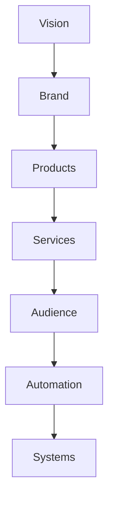

# AI Automation Empire: Building Multiple Income Streams That Work Together

*Part 8 of the **Zero to $100/Day AI Business** series.*

> **Stop trading time for money.**
>
> The ultimate goal isn't to complete more client work. It's to build a collection of assets and systems that generate income from multiple sources.

This chapter explores how to move beyond freelancing and create a diversified AI-powered business.

---

# Table of Contents

- Why One Income Stream Is Risky
- The AI Business Pyramid
- The Seven Layers of an AI Business
- Building Your Asset Stack
- AI Automation Workflow
- No-Code Business Systems
- Creating Digital Products
- Subscription Income
- Affiliate Income
- Licensing Your Work
- Building a Personal Brand
- The AI Tech Stack
- Risk Management
- A 5-Year Roadmap
- Final Thoughts

---

# The Problem With One Income Stream

Imagine your income looks like this:

```text
Client
   │
   ▼
 You
   │
   ▼
Income
```

If the client leaves...

Income stops.

Now compare it with this.

```text
Clients
Digital Products
Templates
Courses
Affiliate Income
Subscriptions
Consulting

        │
        ▼

     Your Business

        │
        ▼

     Monthly Income
```

One customer leaving is no longer a disaster.

---

# The AI Business Pyramid



Every level supports the next.

---

# Layer 1 — Services

Your first revenue source.

Examples:

- Resume writing
- Blog writing
- AI consulting
- LinkedIn optimization
- Marketing copy

Services generate cash quickly.

---

# Layer 2 — Templates

Every completed project becomes a template.

Examples:

- Resume template
- Proposal template
- Invoice template
- Prompt template
- SOP template

Templates save time and can later become products.

---

# Layer 3 — Digital Products

Turn your knowledge into downloadable resources.

Ideas:

- Prompt libraries
- Canva packs
- Resume kits
- AI workflows
- Productivity planners
- Business checklists

Digital products can be sold repeatedly without recreating them.

---

# Layer 4 — Online Courses

Teach what you've learned.

Possible course topics:

- ChatGPT for Beginners
- AI for Small Businesses
- Prompt Engineering
- Resume Writing with AI
- AI Productivity

Educational content creates another income source while strengthening your reputation.

---

# Layer 5 — Consulting

Businesses often need guidance implementing AI effectively.

Possible services:

- AI readiness assessments
- Workflow design
- Prompt optimization
- Team training
- Documentation

Consulting usually commands higher fees because it combines technical knowledge with business understanding.

---

# Layer 6 — Community

Build a space where people can learn together.

Examples:

- Discord
- Telegram
- Slack
- Email newsletter
- Private forum

Communities create opportunities for feedback, partnerships, and recurring engagement.

---

# Layer 7 — Software

Eventually, recurring tasks may inspire software solutions.

Ideas include:

- Resume generators
- AI document assistants
- Proposal builders
- Research dashboards
- Content planning tools

Software requires more effort but can become a scalable product.

---

# Build an Asset Stack

Think of every project as an opportunity to create reusable assets.

```text
Client Project

↓

Prompt

↓

Template

↓

Case Study

↓

Blog Article

↓

Video

↓

Course Lesson

↓

Digital Product
```

One project can generate many long-term assets.

---

# AI Automation Workflow


The goal is consistency and efficiency.

---

# No-Code Automation Ideas

As your business grows, consider using automation platforms to connect repetitive tasks.

Examples:

- Form submission → Spreadsheet
- Payment confirmation → Welcome email
- Completed project → Archive folder
- New inquiry → Task list

Automate repetitive administrative work while keeping human review for important decisions.

---

# Build Monthly Recurring Revenue

Recurring income improves stability.

Examples:

## Content Subscription

Deliver each month:

- Blog articles
- Social posts
- Newsletters

---

## AI Assistant Package

Monthly services:

- Prompt updates
- Workflow reviews
- Documentation improvements

---

## Business Support Plan

Offer:

- Monthly consultation
- AI implementation advice
- Process documentation

Recurring clients reduce the pressure of constantly finding new work.

---

# Create an Evergreen Knowledge Base

Maintain documentation for:

- Frequently asked questions
- Standard prompts
- Checklists
- SOPs
- Client onboarding
- Brand guidelines

A knowledge base improves consistency and supports future growth.

---

# Affiliate Income

Recommend tools that you genuinely use and believe provide value.

Possible categories:

- AI software
- Design tools
- Productivity apps
- Hosting services
- Educational platforms

Always disclose affiliate relationships where required.

---

# Licensing Your Work

Reusable assets can sometimes be licensed.

Examples:

- Templates
- Prompt libraries
- Documentation frameworks
- Educational materials

Licensing creates additional opportunities beyond direct client work.

---

# Build a Personal Brand

You don't need millions of followers.

You need credibility.

Ways to build it:

- Publish tutorials
- Share case studies
- Write blog posts
- Answer questions in communities
- Speak at local events or webinars

Consistent, helpful content builds trust over time.

---

# Your AI Tech Stack

Example toolkit:

| Purpose | Tool Type |
|----------|-----------|
| Writing | AI assistant |
| Documents | Cloud editor |
| Design | Graphic design platform |
| Storage | Cloud drive |
| Notes | Knowledge management |
| Task Tracking | Project management |
| Communication | Email & messaging |

Choose tools that fit your workflow rather than chasing every new release.

---

# Protect Your Business

Risk management matters.

Suggestions:

- Back up important files.
- Use strong passwords.
- Enable multi-factor authentication.
- Maintain written client agreements.
- Keep financial records organized.

Preparation reduces future problems.

---

# Five-Year Vision

Illustrative roadmap:

## Year 1

- Build skills
- Gain clients
- Create templates

---

## Year 2

- Increase prices
- Launch digital products
- Build recurring revenue

---

## Year 3

- Publish educational content
- Expand portfolio
- Develop partnerships

---

## Year 4

- Introduce software or advanced services
- Document internal systems
- Delegate repetitive work

---

## Year 5

- Operate a business supported by diversified income streams, documented processes, and long-term client relationships.

Remember that timelines differ for everyone.

---

# Monthly CEO Checklist

- [ ] Review revenue
- [ ] Review expenses
- [ ] Improve one workflow
- [ ] Publish one educational resource
- [ ] Update portfolio
- [ ] Improve one template
- [ ] Contact previous clients
- [ ] Plan next month's priorities

---

# Common Mistakes

## Chasing Every Trend

Focus on solving real customer problems.

---

## Buying Too Many Tools

Free tools are often sufficient during the early stages.

---

## Neglecting Documentation

Document successful processes while they are fresh.

---

## Ignoring Existing Customers

Satisfied clients often become your best source of repeat business and referrals.

---

# Key Takeaways

- Diversified income reduces business risk.
- Every client project can create reusable assets.
- Systems and documentation improve efficiency.
- Recurring revenue provides stability.
- Long-term success comes from continuous improvement rather than shortcuts.

---

# Looking Ahead

With eight parts complete, you've built a complete roadmap covering:

1. Launching an AI service business
2. Choosing profitable services
3. Using free tools effectively
4. Finding paying clients
5. Scaling your operations
6. Building an AI agency
7. Exploring 100 AI business ideas
8. Creating multiple AI-powered income streams

Future advanced topics could include AI agents, workflow orchestration, retrieval-augmented generation (RAG), enterprise AI adoption, API integrations, and building AI-powered SaaS products.

---

## Series Navigation

- ✅ Part 1 — Launch Your AI Service Business
- ✅ Part 2 — Choosing Profitable AI Services
- ✅ Part 3 — Building with Free Tools
- ✅ Part 4 — Finding Paying Clients
- ✅ Part 5 — Scaling to $100+ Days
- ✅ Part 6 — Building an AI Agency
- ✅ Part 7 — 100 AI Business Ideas
- ✅ Part 8 — AI Automation Empire

*End of Part 8.*
