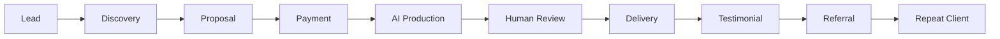
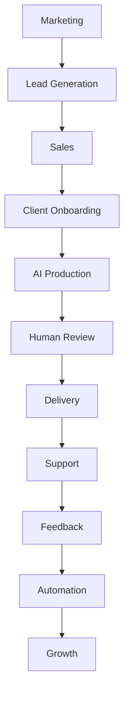

# AI Business Mastery Handbook
## Part 10 — The Complete Operating System for Building an AI-Powered Business

> **The final volume of the Zero to $100/Day AI Business series**

---

> **"AI won't replace entrepreneurs. Entrepreneurs who effectively use AI will often outperform those who don't."**

Welcome to the final installment of this series.

Over the previous nine articles, you've learned how to:

- Launch an AI-powered service business
- Find paying clients
- Build systems
- Scale operations
- Create digital assets
- Diversify income
- Think like a business owner

This handbook brings those ideas together into a practical reference that you can return to as your business evolves.

---

# Table of Contents

1. The AI Business Mindset
2. The AI Business Framework
3. The Five Levels of AI Businesses
4. 50 High-Demand AI Services
5. The AI Tool Stack
6. Standard Operating Procedures
7. Client Acquisition System
8. Sales Scripts
9. Pricing Models
10. AI Prompt Library
11. Automation Ideas
12. Scaling Roadmap
13. Business Metrics
14. Daily CEO Dashboard
15. Resources

---

# Chapter 1
# The AI Business Mindset

AI is a productivity multiplier.

Your real business is solving problems.

Remember this equation.

```
Customer Problem

↓

Your Expertise

↓

AI Assistance

↓

Professional Delivery

↓

Customer Success
```

Never sell AI.

Sell outcomes.

---

# The Three Core Principles

## Solve

Identify real problems.

---

## Simplify

Reduce complexity.

---

## Systemize

Turn success into repeatable processes.

---

# Chapter 2
# The AI Business Framework



Everything you do should fit somewhere inside this workflow.

---

# Chapter 3
# Five Levels of AI Businesses

## Level 1

Freelancer

Characteristics

- One person
- Time-based income

---

## Level 2

Specialist

Characteristics

- Higher prices
- Better systems

---

## Level 3

Agency

Characteristics

- Team
- SOPs
- Delegation

---

## Level 4

Product Company

Characteristics

- Digital products
- Courses
- Templates
- Memberships

---

## Level 5

Software Company

Characteristics

- SaaS
- APIs
- AI Agents
- Platforms

---

# Chapter 4
# 50 High-Demand AI Services

## Career

- Resume Writing
- Cover Letters
- LinkedIn Optimization
- Interview Preparation
- Career Coaching

---

## Marketing

- Blog Writing
- SEO Content
- Email Marketing
- Social Media
- Product Descriptions

---

## Business

- SOP Creation
- Research
- Meeting Summaries
- Documentation
- Knowledge Bases

---

## Creative

- Presentation Design
- Canva Templates
- Brand Kits
- Newsletters
- Prompt Libraries

---

## Technical

- AI Workflow Design
- Documentation
- Prompt Engineering
- Automation Planning
- Chatbot Design

---

# Chapter 5
# AI Tool Stack

| Category | Examples |
|-----------|----------|
| Writing | AI assistants |
| Design | Canva |
| Documents | Google Docs |
| Storage | Google Drive |
| Notes | Notion |
| Spreadsheets | Google Sheets |
| Version Control | GitHub |
| Publishing | GitHub Pages |

Choose tools that fit your workflow rather than using every available option.

---

# Chapter 6
# Standard Operating Procedures

Every repeatable task deserves an SOP.

Example:

```text
Receive Inquiry

↓

Collect Requirements

↓

Generate Draft

↓

Review

↓

Format

↓

Quality Check

↓

Deliver

↓

Request Feedback
```

Document improvements after each project.

---

# Chapter 7
# Client Acquisition System

Daily rhythm:

| Task | Target |
|-------|-------:|
| New Prospects | 20 |
| Personalized Outreach | 15 |
| Follow-ups | 10 |
| Discovery Calls | 2 |
| Delivered Projects | 1–3 |

Consistency beats intensity.

---

# Chapter 8
# Sales Scripts

## Initial Message

```
Hello,

I noticed you're looking for help with [problem].

I specialize in helping people solve exactly that.

If you're interested, I'd be happy to explain how I can help.

Thank you.
```

---

## Follow-up

```
Hello,

Just checking whether you had any questions regarding my previous message.

Happy to help whenever you're ready.

Have a great day.
```

---

## Delivery

```
Hello,

Your project is complete.

The requested files are attached.

Please let me know if you'd like any revisions.

Thank you for your business.
```

---

# Chapter 9
# Pricing Models

Examples:

### Fixed Price

Simple projects.

---

### Hourly

Consulting.

---

### Retainer

Monthly support.

---

### Value-Based

Pricing reflects the value delivered rather than the time spent.

Choose the approach that best fits the project.

---

# Chapter 10
# Prompt Library

Examples:

## Resume Prompt

```
Rewrite this resume for ATS compatibility using strong action verbs and measurable achievements.
```

---

## Blog Prompt

```
Write a detailed SEO-friendly article with headings, FAQs, and practical examples.
```

---

## Email Prompt

```
Rewrite this email in a clear, professional, and concise tone.
```

Continue refining prompts based on experience.

---

# Chapter 11
# Automation Ideas

Examples:

- Client inquiry → CRM
- Payment → Welcome email
- Project complete → Archive
- Testimonial received → Portfolio update

Automation reduces repetitive work while maintaining quality.

---

# Chapter 12
# Scaling Roadmap

### Phase 1

Freelancing

↓

### Phase 2

Systems

↓

### Phase 3

Delegation

↓

### Phase 4

Digital Products

↓

### Phase 5

Software

↓

### Phase 6

Investment

Growth happens gradually.

---

# Chapter 13
# Business Metrics

Monitor:

| Metric | Why It Matters |
|---------|----------------|
| Leads | Pipeline health |
| Conversion Rate | Sales effectiveness |
| Average Order Value | Revenue growth |
| Repeat Customers | Loyalty |
| Monthly Revenue | Growth |
| Profit Margin | Sustainability |

Review metrics regularly.

---

# Chapter 14
# Daily CEO Dashboard

Every morning:

- Review leads
- Review projects
- Check finances
- Plan priorities

Every evening:

- Deliver work
- Follow up
- Improve one system
- Learn one new skill

Small daily improvements accumulate over time.

---

# Chapter 15
# The 365-Day AI Business Roadmap

## Quarter 1

Focus:

- Learn
- Practice
- Get first clients

---

## Quarter 2

Focus:

- Raise prices
- Build templates
- Create SOPs

---

## Quarter 3

Focus:

- Launch digital products
- Build recurring revenue
- Improve automation

---

## Quarter 4

Focus:

- Strengthen your brand
- Expand your portfolio
- Review annual progress
- Plan the next stage of growth

---

# The AI Business Operating System



---

# The AI Entrepreneur's Principles

1. Solve meaningful problems.
2. Learn continuously.
3. Build systems before scaling.
4. Document what works.
5. Deliver consistently.
6. Price fairly.
7. Improve every week.
8. Build assets, not just income.
9. Respect your customers.
10. Think long term.

---

# Annual Business Checklist

- [ ] Updated portfolio
- [ ] Refined SOPs
- [ ] Improved prompt library
- [ ] Reviewed pricing
- [ ] Backed up important files
- [ ] Updated financial records
- [ ] Published educational content
- [ ] Requested testimonials
- [ ] Learned new AI capabilities
- [ ] Planned next year's goals

---

# Final Thoughts

Artificial intelligence is changing how work gets done, but successful businesses are still built on timeless principles: understanding customers, delivering value, communicating clearly, and improving continuously.

Technology will evolve. Tools will change. Markets will shift.

The businesses that last will be those that combine AI with sound judgment, professionalism, and a commitment to solving real problems.

Use this handbook as a living document. Update your processes, refine your prompts, and keep learning as the technology matures.

---

# Congratulations

You have completed the **Zero to $100/Day AI Business** series.

The journey doesn't end here.

Keep building, keep experimenting, and keep creating value.

---

## Complete Series

- ✅ Part 1 — Launch an AI Service Business
- ✅ Part 2 — Choose a Profitable AI Service
- ✅ Part 3 — Build Your Business with Free Tools
- ✅ Part 4 — Find Paying Clients
- ✅ Part 5 — Scale to Consistent $100+ Days
- ✅ Part 6 — Build an AI Agency
- ✅ Part 7 — 100 AI Business Ideas
- ✅ Part 8 — AI Automation Empire
- ✅ Part 9 — The Ultimate AI Solopreneur Blueprint
- ✅ Part 10 — AI Business Mastery Handbook

> *Thank you for following this series. I hope it helps you build something meaningful.*
