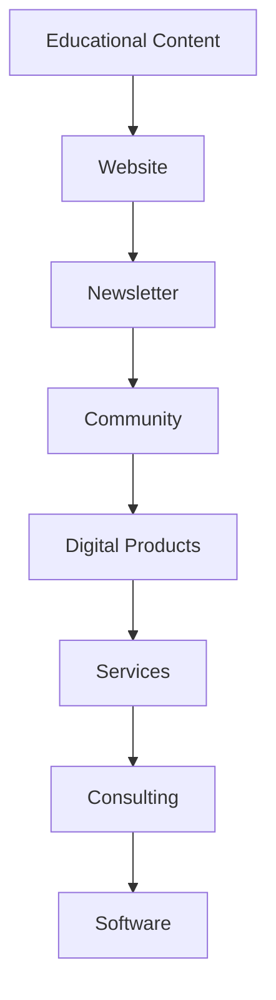
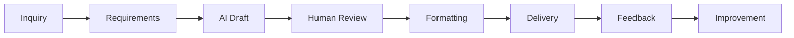
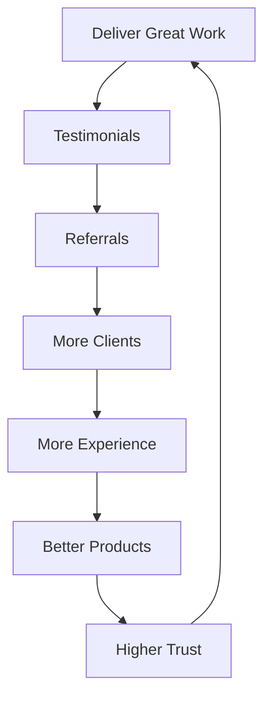

# The AI Millionaire Playbook
## Part 11 — Building a Digital Empire with AI, Automation, and Systems

> *"Businesses become valuable when they stop depending on the founder's time and start depending on systems."*

Welcome to **Part 11** of the **Zero to $100/Day AI Business** series.

The previous ten articles focused on earning your first income, finding clients, creating products, and building systems. This chapter explores what comes next: creating a business that can grow for years through repeatable processes, valuable assets, and thoughtful use of AI.

---

# Table of Contents

1. Rethinking Business Growth
2. The Four Types of Digital Assets
3. The AI Business Ecosystem
4. Building a Product Portfolio
5. Content as a Long-Term Asset
6. Creating an AI Knowledge Base
7. Productizing Expertise
8. Automation Strategy
9. Delegation Framework
10. Measuring Business Health
11. Long-Term Planning
12. Final Thoughts

---

# Rethinking Business Growth

Many people measure success by hours worked.

Businesses grow differently.

Instead of asking:

> "How many hours can I work?"

Ask:

> "How many times can this solution be reused?"

Reusable work compounds.

---

# The Four Types of Digital Assets

Your business should gradually accumulate assets that continue providing value.

## 1. Knowledge Assets

Examples:

- Standard Operating Procedures (SOPs)
- Prompt libraries
- Documentation
- Checklists
- Internal guides

---

## 2. Content Assets

Examples:

- Blog articles
- Tutorials
- Videos
- Newsletters
- Case studies

Content builds trust over time.

---

## 3. Product Assets

Examples:

- Templates
- E-books
- Courses
- Prompt collections
- Digital planners

Products can be sold repeatedly without recreating them.

---

## 4. Software Assets

Examples:

- AI assistants
- Internal tools
- Automation dashboards
- Micro SaaS applications

Software often requires greater investment but can support long-term scalability.

---

# The AI Business Ecosystem

Each component strengthens the others.

---

# Building a Product Portfolio

Rather than relying on a single offer, consider creating complementary products.

Example:

## Career Toolkit

- Resume template
- Cover letter guide
- Interview checklist
- LinkedIn optimization guide

---

## Small Business Toolkit

- Business proposal template
- SOP framework
- Meeting agenda
- AI prompt collection

Grouping related products creates more value for customers.

---

# Content as a Long-Term Asset

Every completed project can inspire educational content.

Possible formats:

- Blog post
- Video tutorial
- Checklist
- FAQ
- Case study

Publishing consistently helps demonstrate expertise.

---

# Create an AI Knowledge Base

Maintain documentation for:

- Frequently asked questions
- Prompt examples
- Client onboarding
- Quality standards
- Pricing guidelines
- Brand voice

This reduces repetitive work and supports future collaboration.

---

# Productize Your Expertise

Whenever you solve the same problem repeatedly, ask:

- Can this become a template?
- Can this become a guide?
- Can this become a downloadable resource?
- Can this become a course?

The answer is often yes.

---

# Build a Repeatable Workflow

Continuous improvement is part of the workflow.

---

# Automation Strategy

Automate repetitive administrative tasks while keeping human oversight for decisions that require judgment.

Possible automation opportunities:

- Inquiry tracking
- File organization
- Reminder emails
- Project status updates
- Calendar scheduling

Review automated workflows regularly to ensure they continue meeting customer needs.

---

# Delegation Framework

As demand grows, identify tasks that follow clear procedures.

Examples:

| Task | Can Be Documented? | Suitable for Delegation? |
|------|--------------------|--------------------------|
| Formatting | Yes | Yes |
| Research | Yes | Often |
| Proofreading | Yes | Often |
| Strategic consulting | Partially | Usually remains founder-led |

Delegate only after documenting the process.

---

# Measuring Business Health

Track a small number of meaningful metrics.

| Metric | Purpose |
|--------|---------|
| New inquiries | Demand |
| Conversion rate | Sales effectiveness |
| Repeat clients | Customer satisfaction |
| Average project value | Revenue quality |
| Monthly recurring revenue | Stability |
| Customer referrals | Reputation |

Avoid tracking dozens of metrics that don't influence decisions.

---

# Quarterly Review Questions

At the end of every quarter, ask:

- Which service created the most value?
- Which product sold consistently?
- Which process should be improved?
- Which tasks could be automated?
- Which customer feedback should influence future work?

Document your answers.

---

# Long-Term Planning

Illustrative progression:

## Year 1

Focus on:

- Skills
- Clients
- Templates

---

## Year 2

Focus on:

- Documentation
- Digital products
- Better systems

---

## Year 3

Focus on:

- Automation
- Partnerships
- Recurring revenue

---

## Year 4

Focus on:

- Software
- Team development
- Operational efficiency

---

## Year 5

Focus on:

- Sustainable growth
- Product expansion
- Long-term strategy

Actual timelines will vary depending on your goals, experience, and market.

---

# The Business Flywheel

Each successful project strengthens the next.

---

# Monthly Review Checklist

- [ ] Update portfolio
- [ ] Improve one SOP
- [ ] Refine one AI prompt
- [ ] Publish one educational article
- [ ] Follow up with previous clients
- [ ] Review pricing
- [ ] Back up business files
- [ ] Analyze customer feedback

Small improvements made consistently can have a significant impact over time.

---

# Final Thoughts

Technology evolves quickly, but successful businesses continue to rely on enduring principles:

- Solve meaningful problems.
- Build trust.
- Deliver quality.
- Document what works.
- Improve continuously.

AI can accelerate your work, but sustainable businesses are built through professionalism, thoughtful systems, and long-term relationships with customers.

Treat every project as an opportunity to create reusable knowledge, improve your process, and strengthen your business.

---

## What's Next?

Future topics in this series could explore:

- AI Agents for business workflows
- Retrieval-Augmented Generation (RAG)
- Local AI models
- AI-assisted software development
- Enterprise AI implementation
- Building AI-powered SaaS products
- AI governance and responsible deployment

---

## Series Navigation

- ✅ Part 1 — Launch Your AI Service Business
- ✅ Part 2 — Choosing Profitable AI Services
- ✅ Part 3 — Building with Free Tools
- ✅ Part 4 — Finding Paying Clients
- ✅ Part 5 — Scaling Operations
- ✅ Part 6 — Building an AI Agency
- ✅ Part 7 — 100 AI Business Ideas
- ✅ Part 8 — AI Automation Empire
- ✅ Part 9 — The Ultimate AI Solopreneur Blueprint
- ✅ Part 10 — AI Business Mastery Handbook
- ✅ Part 11 — The AI Millionaire Playbook

*End of Part 11.*
