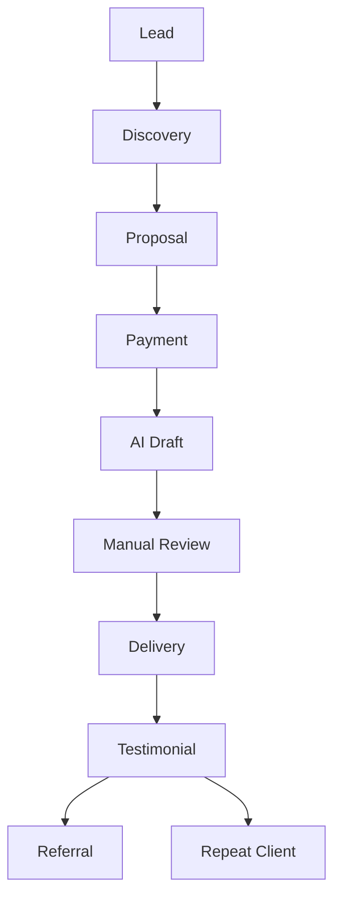

# Scaling Your AI Service Business to Consistent $100+ Days

*Part 5 of the **Zero to $100/Day AI Business** series.*

> Getting your first client proves your idea works.
>
> Building systems turns occasional income into a predictable business.
>
> This final article focuses on increasing revenue without working significantly more hours.

---

# Table of Contents

- The Difference Between Freelancing and a Business
- Understanding Revenue Growth
- Increasing Average Order Value
- Building Service Packages
- Creating Standard Operating Procedures (SOPs)
- AI Workflow Automation
- Managing Multiple Clients
- Raising Your Prices
- Building Monthly Recurring Revenue
- Expanding Your Services
- Tracking Business Metrics
- Common Scaling Mistakes
- 90-Day Growth Plan
- Final Thoughts

---

# From Freelancer to Business Owner

Many freelancers reach a point where every additional dollar requires additional hours.

A business grows differently.

Instead of thinking:

> "How can I work more?"

Ask:

> "How can I build a system that produces the same result every time?"

---

# The Scaling Formula

```text
Better Systems
        +
Higher Prices
        +
Repeat Clients
        +
Upsells
        +
Automation
        =
Higher Income
```

Scaling isn't about working harder.

It's about improving the process.

---

# Understanding Revenue

Suppose you charge **$25** for a resume rewrite.

Daily income:

| Clients | Revenue |
|---------:|--------:|
| 2 | $50 |
| 4 | $100 |
| 6 | $150 |
| 8 | $200 |

Now imagine increasing your average order value instead.

| Package | Price |
|---------|------:|
| Resume | $25 |
| Resume + Cover Letter | $40 |
| Career Package | $60 |

You may earn more without increasing the number of clients.

---

# Increase Average Order Value

Upselling is one of the easiest ways to grow revenue.

Example:

Client orders:

```
Resume Rewrite
```

Offer:

- LinkedIn Profile Optimization
- Cover Letter
- Interview Preparation Guide
- Thank You Email Templates

Instead of:

```
$25
```

Your order becomes:

```
$60
```

---

# Build Service Packages

Avoid selling only one item.

## Starter Package

Includes:

- Resume Rewrite
- PDF Formatting

Price:

```
$25
```

---

## Professional Package

Includes:

- Resume Rewrite
- Cover Letter
- LinkedIn Optimization

Price:

```
$50
```

---

## Premium Package

Includes:

- Everything above
- Interview Questions
- Career Strategy Guide
- Two Revisions

Price:

```
$75
```

Clients often choose the middle option when presented with three choices.

---

# Create Standard Operating Procedures (SOPs)

Document every repeatable task.

Example:

```text
Resume Workflow

1. Receive client files
2. Read job description
3. Generate AI draft
4. Review manually
5. Improve wording
6. Format document
7. Export PDF
8. Deliver
9. Request feedback
10. Archive project
```

SOPs reduce mistakes and save time.

---

# Create a Prompt Library

Organize your prompts.

```text
Prompts/

├── Resume.md
├── CoverLetter.md
├── LinkedIn.md
├── Email.md
├── ProductDescriptions.md
├── BlogWriting.md
└── Editing.md
```

Improve prompts after every project.

Your prompt library becomes a competitive advantage.

---

# Reuse Templates

Templates save hours every week.

Examples:

- Welcome message
- Client questionnaire
- Proposal
- Invoice
- Delivery message
- Testimonial request

Instead of rewriting the same messages repeatedly, duplicate and personalize them.

---

# Deliver Faster

Time spent per project matters.

Example:

Without templates:

```
2 hours
```

With templates:

```
45 minutes
```

If quality remains the same, you've increased your earning potential.

---

# Build a Knowledge Base

Maintain documents for:

- Frequently asked questions
- Pricing
- Common prompts
- Client instructions
- Revision policies

This reduces repetitive work.

---

# Build Monthly Recurring Revenue

One-time projects are valuable.

Recurring clients are better.

Examples:

## Content Package

Deliver each month:

- 8 blog posts
- 20 social media captions
- 4 newsletters

Monthly fee:

```
$300
```

---

## Local Business Package

Monthly deliverables:

- Google Business updates
- Review responses
- Social posts
- Promotions

Monthly fee:

```
$150
```

---

## LinkedIn Package

Each month:

- Profile updates
- Weekly posts
- Personal branding content

Monthly fee:

```
$200
```

Recurring income provides stability.

---

# Raise Your Prices

Don't keep introductory prices forever.

A simple approach:

| Completed Projects | Suggested Increase |
|-------------------:|-------------------:|
| 5 | +10% |
| 15 | +15% |
| 30 | +20% |
| 50+ | Review pricing based on demand |

Raise prices gradually and communicate the value you provide.

---

# Track Your Business Metrics

Use a spreadsheet.

| Metric | Target |
|--------|-------:|
| Leads | 150/month |
| Replies | 40/month |
| Clients | 15/month |
| Average Order | $45 |
| Monthly Revenue | $675+ |

Tracking helps identify what is working.

---

# Automate Repetitive Tasks

Examples:

- Save reusable prompts.
- Use document templates.
- Organize folders automatically.
- Create reusable Canva designs.
- Maintain a checklist for every delivery.

Automation should improve consistency, not replace quality.

---

# Build a Portfolio

As projects grow, create a portfolio.

Include:

- Before and after examples
- Testimonials
- Case studies
- Service descriptions
- Frequently asked questions

A portfolio reduces the need to explain your work repeatedly.

---

# Request Reviews

Every completed project should end with a polite request.

Example:

```text
Thank you for choosing my service.

If you found the work helpful, I'd appreciate a short review or testimonial.

Your feedback helps future clients understand the value of my services.
```

Reviews increase trust.

---

# Ask for Referrals

Satisfied clients often know others with similar needs.

Example:

```text
If you know anyone who could benefit from similar services, I'd be grateful if you shared my contact details.

Thank you again!
```

Referrals often convert faster than cold outreach.

---

# Avoid Burnout

Growth should not come at the cost of quality.

Protect your schedule.

Suggestions:

- Set working hours.
- Batch similar tasks.
- Take regular breaks.
- Limit revisions with a clear policy.

---

# Common Scaling Mistakes

## Saying Yes to Everything

Focus on services that are profitable and repeatable.

---

## Underpricing

Low prices can lead to excessive workload.

Review pricing regularly.

---

## Ignoring Systems

Every repeated task should become a documented process.

---

## Neglecting Existing Clients

Repeat customers often provide more value than constantly finding new ones.

---

# 90-Day Growth Plan

## Month 1

- Complete first projects.
- Build templates.
- Collect testimonials.

---

## Month 2

- Increase outreach.
- Raise prices slightly.
- Add service packages.

---

## Month 3

- Introduce recurring plans.
- Improve automation.
- Build a simple portfolio website.
- Focus on referrals and repeat business.

---

# Business Growth Workflow



---

# Weekly Business Review

Every week, ask yourself:

- Which service sold the most?
- Which projects were most profitable?
- Which tasks took the longest?
- What can be automated?
- Which clients may need future work?

Continuous improvement compounds over time.

---

# Final Checklist

- [ ] Service packages created
- [ ] Prompt library maintained
- [ ] Templates organized
- [ ] Portfolio updated
- [ ] Testimonials collected
- [ ] Pricing reviewed
- [ ] Monthly packages available
- [ ] Client spreadsheet updated
- [ ] Weekly review completed

---

# Final Thoughts

Building an AI-assisted service business does not require expensive software, a large audience, or paid advertising.

Success comes from:

- Solving real problems.
- Delivering consistently.
- Communicating professionally.
- Improving your systems.
- Building long-term relationships with clients.

Focus on quality, keep refining your workflow, and treat every project as an opportunity to learn. Over time, small improvements in efficiency, pricing, and client retention can create a stable and sustainable business.

---

# Series Summary

Congratulations! You've completed the **Zero to $100/Day AI Business** series.

### Part 1
**How to Build a $100/Day AI Income Machine in 48 Hours Using Only Your Phone**

Learned:

- Business model
- Mindset
- 48-hour launch plan

---

### Part 2
**Choosing an AI Service That Can Earn $100 Per Day**

Learned:

- Profitable AI services
- Niches
- Pricing
- Service packaging

---

### Part 3
**Building Your AI Service Business with Free Tools**

Learned:

- Free software
- Templates
- Prompt libraries
- Workflows

---

### Part 4
**Finding Paying Clients Without Followers or Ads**

Learned:

- Outreach
- Prospecting
- Closing
- Follow-up

---

### Part 5
**Scaling Your AI Service Business to Consistent $100+ Days**

Learned:

- Systems
- Automation
- Upselling
- Recurring revenue
- Long-term growth

---

## What's Next?

Once you've mastered these fundamentals, consider expanding into:

- AI consulting
- Workflow automation
- Custom GPT development
- Prompt engineering services
- AI training for businesses
- Digital products and templates
- Online courses
- Agency models

Each of these builds on the same foundation: solving real problems efficiently with AI.

Happy building, and good luck on your journey!
